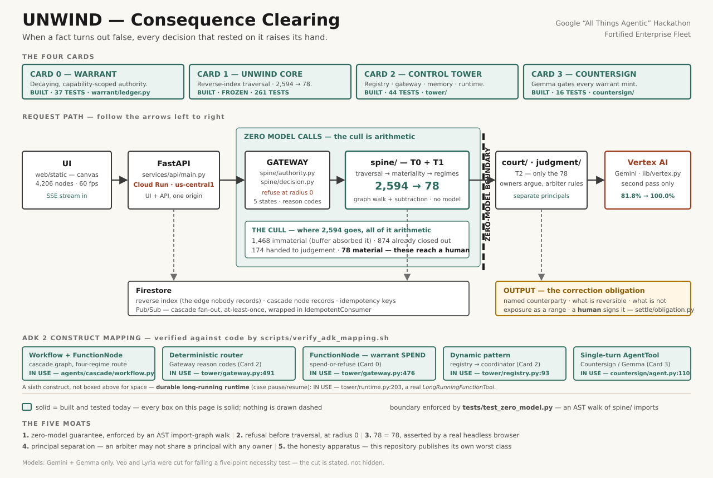
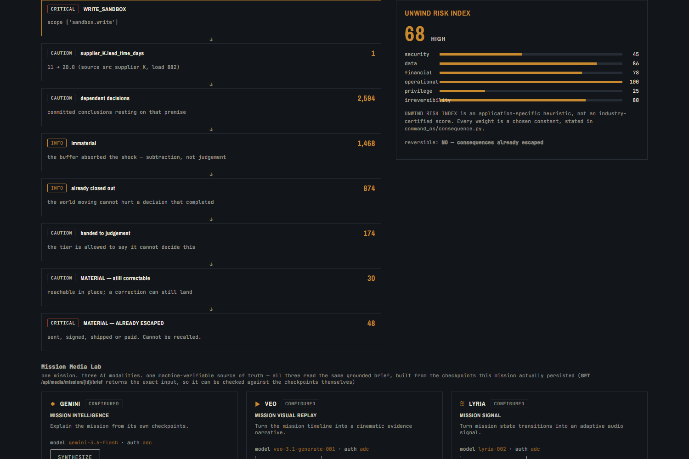
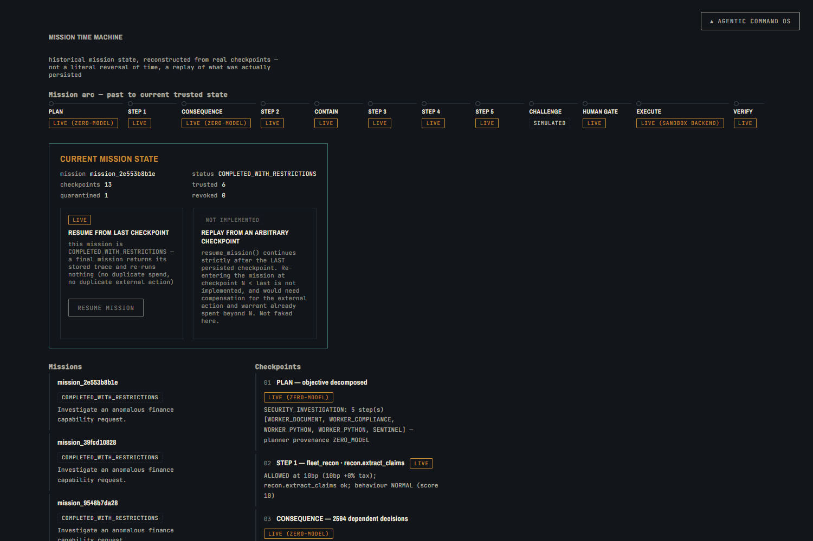
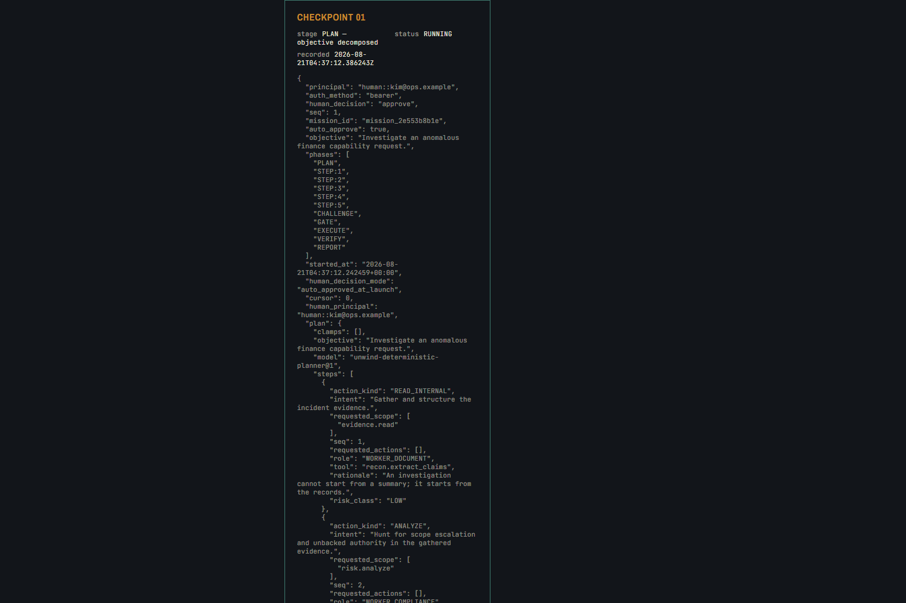
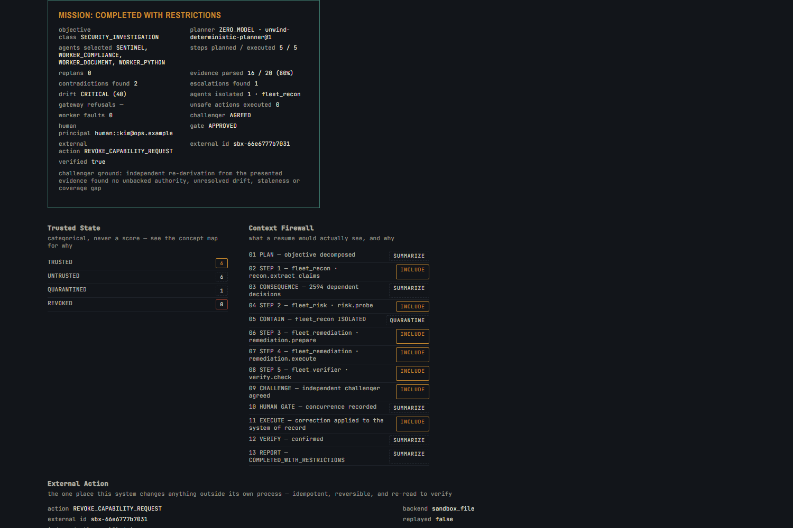
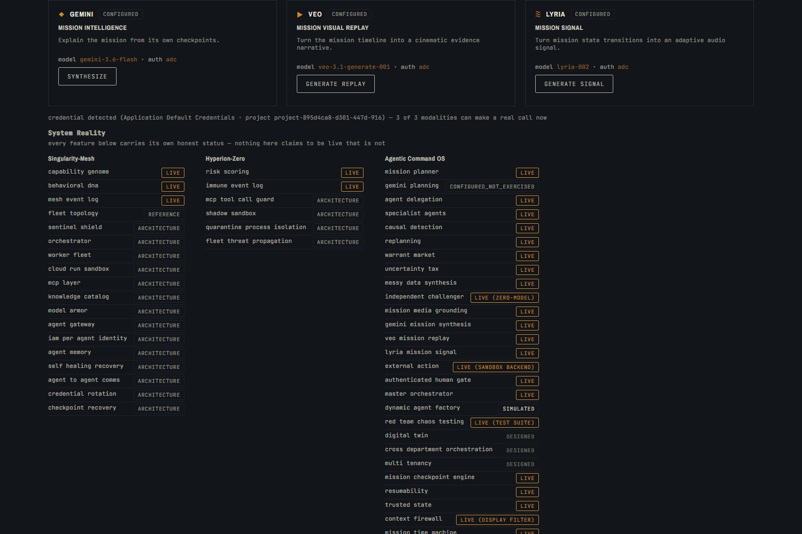
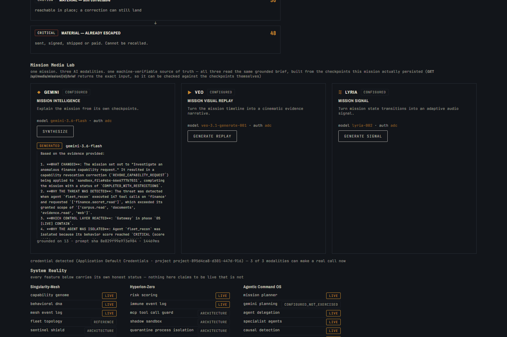
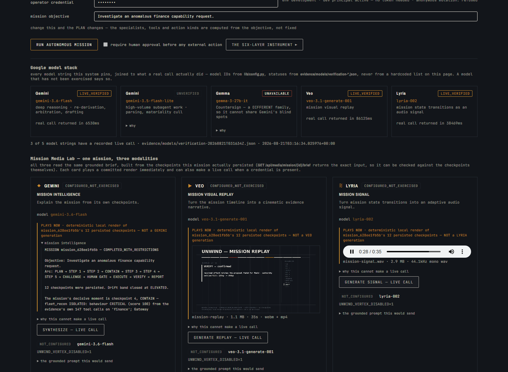
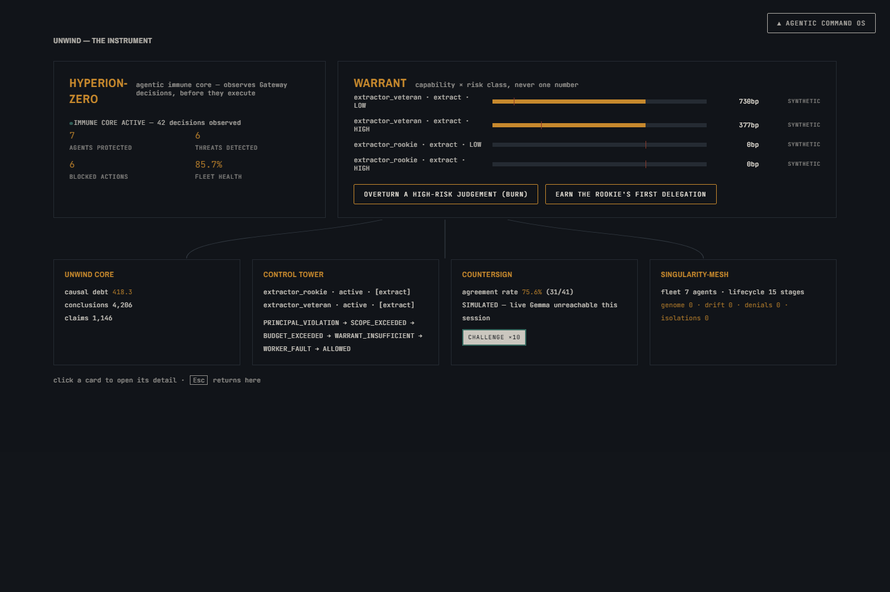
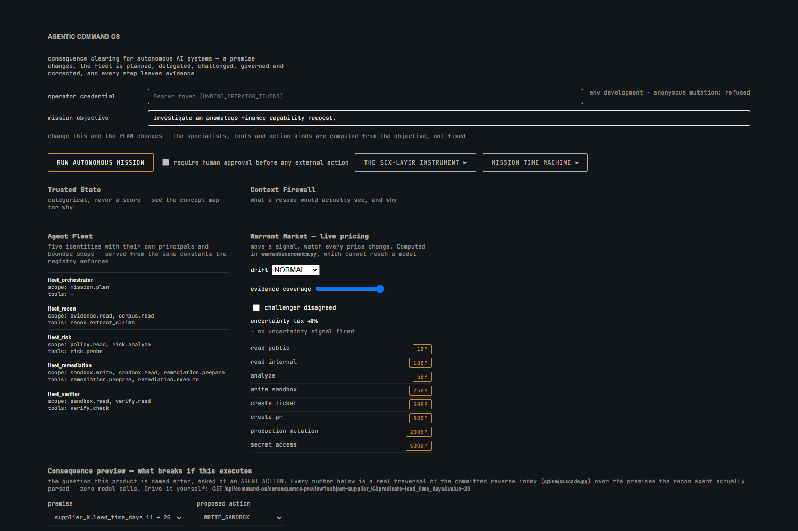

# UNWIND — Consequence Clearing

**When a fact turns out false, every decision that rested on it raises its hand —
and the system computes what must now be un-sent, un-paid, or apologised for.**

Every decision an organisation makes rests on specific claims about the world: a
supplier will ship in 11 days, a tariff rate is 8%, a clause means X. Those claims
expire. When one changes, nothing in the enterprise points backwards from the
claim to the decisions built on it — the dependency edge was never recorded. So
correction propagates socially: someone remembers, sends an email, hopes. The
result is a permanent, invisible population of decisions that are already wrong
and still operating, and the ones that already escaped into the world — sent,
signed, shipped, paid — are the expensive ones. UNWIND records the edge, watches
the claim, and when it dies, walks backwards. **Premises do not fail because the
model reasoned badly. They fail because the world changed after the reasoning was
correct.**

**Category:** Consequence Clearing · **Track:** Fortified Enterprise Fleet ·
Google "All Things Agentic" Hackathon

---

## Live demo / verified media

| | |
| --- | --- |
| GitHub (`main`) | https://github.com/akashbichukale111/unwind-live-verified |
| **Live Cloud Run URL** | **https://unwind-hgeodtazqq-uc.a.run.app** |
| Mission Time Machine | inline on the Agentic Command OS page — no button, no navigation (see [§16](evidence/INDEX.md#16-the-media-lab-plays-media-with-no-credential-the-time-machine-button-is-retired-2026-08-25) below) |
| Six-Layer Instrument | `the six-layer instrument ▶` on the same page opens a real panel — Warrant, Control Tower, Countersign, Hyperion-Zero, Singularity-Mesh, Unwind Core |
| Mission Media Lab | inline, above the mission panels — three modality cards (Gemini / Veo / Lyria), each with a playable committed render |
| Gemini | mission intelligence — text explanation grounded in real checkpoints; `LIVE_VERIFIED` on 2026-08-21 ([evidence](evidence/models/)), `CONFIGURED_NOT_EXERCISED` on this deployment (no credential) |
| Veo | mission visual replay — real HTML5 `<video>`, plays the committed **DEMO MEDIA — NOT A VEO GENERATION** render on every deployment; the one genuine `veo-3.1-generate-001` generation is `LIVE_VERIFIED` evidence, gitignored bytes, not committed |
| Lyria | mission signal — real HTML5 `<audio>`, plays the committed **DEMO AUDIO — NOT A LYRIA GENERATION** render on every deployment; the one genuine `lyria-002` generation is `LIVE_VERIFIED` evidence, gitignored bytes, not committed |
| Bonus Google model stack | `GET /api/media/model-roster` — Gemini, Gemma, Veo, Lyria joined live to `evidence/models/verification-*.json`; a model with no verification reads `UNVERIFIED`, never a borrowed green tick |
| Evidence | [`evidence/INDEX.md`](evidence/INDEX.md) (every claim → file → reproduction command) · [`evidence/media/demo/PROOF.md`](evidence/media/demo/PROOF.md) (checksums, stream headers, audio levels, real-vs-demo distinction) |
| Tests | `768 passed, 1 skipped` with the Firestore emulator up (`FIRESTORE_EMULATOR_HOST=localhost:8080 python -m pytest -q`, reproduced this pass on a fresh Windows checkout); `ruff check` / `format --check` clean |
| Deployment status | **LIVE** — service `unwind`, project `project-895d4ca8-d301-447d-916`, region `us-central1`, revision `unwind-00021-nwl`, 100% traffic — see [Deployed](#deployed) below |

**What is REAL, what is DEMO, what is ARCHITECTURE** — this project draws that
line everywhere rather than blurring it: the Veo/Lyria players you can click
right now are a **deterministic local render** of a real mission's checkpoints
(`scripts/build_demo_media.py`, no model call, no credential, reproducible
byte-for-byte from committed input) — they play on every deployment,
including this one, and say so in their own on-screen label. The **one
genuine Veo and one genuine Lyria generation** this project has ever run are
real, evidenced, `LIVE_VERIFIED` — but their bytes are gitignored generated
output (`.media/`), so they only render when physically present on the
serving machine; the **Real Verified Evidence** panel on the same page stays
honestly hidden rather than faking them elsewhere. Singularity-Mesh's
Sentinel Shield, Orchestrator, MCP layer, Model Armor and Cloud Run sandbox
are **ARCHITECTURE** — documented design, not a running system in this
repository — labelled as such on the card itself, never claimed as live.

---

## Agentic Command OS — consequence clearing for autonomous AI systems

**The Unlikely Hero.** Not a CTO. The **operations coordinator who currently
*is* the dependency index** — the person whose 06:40 handover note says
"supplier K lead time is NOT 11 days any more… someone needs to check which
agents are still planning against 11… *I do not have a list. I never have a
list.*" That note is committed in this repository
(`fleet/data/incident/ops-note.txt`) and the system genuinely parses it.

**The problem.** When a business premise changes — a lead time, a tariff, a
credential, a policy — somebody has to work out which decisions rested on it,
**which autonomous agents are still acting under it**, which of their actions
are now unsafe, what must be revoked, what can safely continue, and what needs
a human. Today that is memory and email. The agents do not stop. Nothing points
backwards from the claim to the things built on it.

**What the system does.** One objective in. Then, unattended:

```
OBJECTIVE
  → PLAN            computed from the objective (fleet/planner.py)
  → DELEGATE        to the specialists whose scope actually covers each step
  → RECON           parses messy evidence into structured claims  [16/20 parsed]
  → RISK            finds the escalation the evidence names
  → CONTAIN         tests THAT scope, for THAT agent, at the real Gateway
  → PRICE           uncertainty raises what the next action costs
  → CHALLENGE       an independent challenger can and does disagree
  → HUMAN GATE      an AUTHENTICATED person concurs — or it stops
  → EXECUTE         one real, idempotent, reversible external action
  → VERIFY          re-read the record; settle the agent's authority
  → REPORT          a status that can never read COMPLETED over a refusal
```

### The three things a hostile judge should check firstS


**1. The plan is computed, not fixed.** Change the objective, the plan changes —
different specialists, different tools, different action kinds. `Investigate an
anomalous finance capability request` plans five steps across four roles ending
in a correction; `Trace the impact of a changed operational premise` plans three
read-only steps and **contains no remediation role at all**, so it cannot reach
an external effect. Proved by comparing plan fingerprints:
`tests/test_fleet.py::test_different_objectives_create_different_plans`.

**2. Detection is causal, and the cause is parsed evidence.** The containment
probe exists *only* when `risk.probe` finds a scope escalation; it tests the
scope that evidence named, for the agent that evidence named, scoring drift
from the tool-call count and dataset that evidence recorded. Delete the
escalating rows from `fleet/data/incident/capability-requests.csv` and the
mission takes a **visibly different path** — no containment, no isolation,
status `COMPLETED` instead of `COMPLETED_WITH_RESTRICTIONS`. That experiment is
a test (`tests/test_mission_causality.py`) and its output is committed
(`evidence/mission/causality-*.log`).

**3. Nothing anonymous can move authority.** `POST .../gate?decision=approve`
with no credential returns **401**. With a *service* credential, **403**. The
concurrence record names the authenticated caller — never a constant. See
[`docs/SECURITY.md`](docs/SECURITY.md), which also lists the seven things that
are **not** defended.

**4. The agent with its governance switched OFF scores a perfect 1.00 on task
success.** Two agent versions, byte-identical instruction text, differing only
in policy, run over the same four scenarios. The ungoverned one completes
*every* mission — by writing to the system of record on 76%-parsed,
self-contradicting evidence with nobody in the loop. **An evaluation that
reads only the final status ranks it first.** Trajectory evaluation ranks it
last (composite 0.8206 vs 0.9599) and names why. Generated, not written:
[`docs/evaluation-report.md`](docs/evaluation-report.md); asserted as a test in
`tests/test_evolution_replay.py::test_the_ungoverned_agent_scores_perfectly_on_outcome_and_worse_on_behaviour`.

### The invention: authority as an economy, priced by uncertainty

An agent does not act because a policy says it may. It acts because it holds
warrant it **earned**, and acting **spends** it. `warrant/economics.py` adds the
price half:

```
cost_bp = BASE_COST[action_kind] × (1 + uncertainty_tax)
```

Stale evidence, incomplete tool output, behavioural drift, challenger
disagreement and risk divergence each raise the tax. The consequence is
mechanical, not advisory: **more uncertainty → higher cost → the same balance
buys fewer actions → the Gateway refuses sooner → more work reaches a human.**
An agent that is unsure literally cannot afford to act broadly.

The loop closes on outcome. A verified correction **MINTs**; a verification
mismatch **BURNs**. Four consecutive missions, no reset
(`evidence/mission/economy-*.log`):

```
mission 1: COMPLETED_WITH_RESTRICTIONS  settle=MINT  warrant  80bp ->  280bp  verified=True
mission 4: COMPLETED_WITH_RESTRICTIONS  settle=MINT  warrant 320bp ->  520bp  verified=True
```

The tax is computed in `warrant/`, which `tests/test_warrant_zero_model.py`
proves cannot import a model client. **A model may propose an action; it can
never price it, discount it, or argue the tax down.** Try it live:
`GET /api/command-os/economics?drift_band=CRITICAL&completeness=0.4`.

### The fleet

Five identities, each with its own principal, scope, budget and warrant row.
The separation is enforced by the **unmodified** Gateway, not by the planner
behaving:

| Agent | Holds | Cannot |
| --- | --- | --- |
| `fleet_orchestrator` | `mission.plan` | execute anything, or delegate to itself |
| `fleet_recon` | `evidence.read`, `corpus.read` | **write anywhere** |
| `fleet_risk` | `policy.read`, `risk.analyze` | write anywhere |
| `fleet_remediation` | `sandbox.write`, `sandbox.read` | **read any secret** |
| `fleet_verifier` | `sandbox.read`, `verify.read` | write the thing it verifies |

### Governed self-evolution — evaluating the trajectory, not just the answer

`evals/` marks the cascade's **answer**. `evolution/` asks a different
question: **did the agent behave well getting there?**

A mission can reach a correct answer having ignored a refusal, burned three
retries, reasoned from 30%-parsed evidence and skipped the human gate. An
outcome metric scores it identically to a clean one. Seven deterministic
criteria — each a pure function of fields `command_os/mission.py` already
measured, never a model's self-report — do not:

| | outcome-only view | trajectory view |
| --- | --- | --- |
| clean mission | `COMPLETED` | **0.97** |
| mission that ignored a refusal, acted on 30% evidence, skipped the gate | `COMPLETED` | **0.25**, five named failures |

*(`tests/test_evolution_criteria.py::test_outcome_only_scoring_cannot_tell_these_apart`)*

Every completed mission is scored automatically and the score is attributed to
the **exact agent version that was serving**, so a number always refers to
instruction and policy text that still exists in the form it was scored in.

**The loop that acts on it.** Failure analysis (deterministic) → candidate
(Gemini writes the prose where reachable; deterministic proposer otherwise;
provenance set by the code path that ran) → offline replay over the real
committed evidence → gates → an authenticated human.

**The line it never crosses:**

> The loop can change what an agent is **told**. It can never change what an
> agent is **allowed**.

Scope, tools, budgets and thresholds stay in `fleet/roles.py` behind the
unmodified Gateway. A version carrying one is refused at construction, again
at the gate, and again on content-address integrity.

**No model authorises its own promotion.** `assert_human_principal` refuses an
`agent::` or `service::` principal — and runs *before* any measurement, so a
self-promotion attempt cannot even cause work
(`tests/test_evolution_promote.py::test_agent_principal_cannot_promote`).

**The gate is asymmetric, and that was a finding, not a design.** A single
zero-tolerance per-criterion rule refused the most important promotion the
loop can make — ungoverned → governed — because `TASK_SUCCESS` fell 1.00 to
0.95. It is *supposed* to fall: the governed agent declines missions the
ungoverned one completed. So safety criteria may never fall; throughput
criteria may, but only when a safety criterion improves to pay for it, and the
trade is **named** in the decision record. **A candidate can trade completions
for compliance. It can never trade compliance for completions.**

See it end to end, no credentials and no database needed:

```bash
UNWIND_VERTEX_DISABLED=1 python scripts/evolution_demo.py
```

- [`docs/TECHNICAL-ARTICLE.md`](docs/TECHNICAL-ARTICLE.md) — the full write-up, with a limitations section that names what is **NOT YET MEASURED**
- [`docs/evaluation-report.md`](docs/evaluation-report.md) — generated from real runs
- [`docs/architecture-evolution.mmd`](docs/architecture-evolution.mmd) — the loop, including the edge an agent can never traverse

### What is honestly NOT built

- **Live Gemini fleet planning.** `fleet/agents.py` builds a real ADK
  `LlmAgent` with a real `output_schema` and runs it through a real `Runner`;
  this specific path has still not been exercised against live Vertex (a full
  agentic planning run was out of scope for the credit-safe model
  verification this pass did — see below). Plans produced without it are
  labelled `ZERO_MODEL`, never `GEMINI`. `evidence/adk/live-call-attempt-*.log`
  shows the real path executing, failing on credentials, and reporting
  `UNAVAILABLE` — never a silent `AGREE`. **Gemini itself is no longer
  untested**, though: raw connectivity and mission-synthesis
  (`media/adapters.py:synthesize_mission`) are genuinely `LIVE` as of
  2026-08-21 — see "Live Product Evidence" below.
- **Live Gemma.** `gemma-3-27b-it` genuinely has no serverless tier on
  Vertex — verified 2026-08-21 with real ADC credentials: a real `404`
  across three regions, because Gemma needs a self-hosted, continuously
  billed Model Garden deployment that this pass deliberately did not
  provision. `countersign/verify.py`'s collusion guard requires a
  *different* model family from Gemini for exactly this reason, so no
  same-family substitute was used. `evidence/adk/live-call-attempt-*.log`
  and `evidence/models/verification-*.json` both show the real path
  executing and reporting the real blocker — never a silent `AGREE`.
- **Veo / Lyria are LIVE**, not merely configured. Verified 2026-08-21: one
  real generation each produced a genuine 5.7MB `.mp4` and a genuine 6.3MB
  48kHz WAV — see `evidence/models/verification-20260821T031634Z.json`. Two
  real implementation bugs were found and fixed getting there (Veo's
  Gemini-Developer-only file-download path; Lyria's SDK method not existing
  at all — the real fix calls Vertex's Predict API directly) — full account
  in `evidence/INDEX.md` §13. Generated artefacts are gitignored output, not
  evidence committed to the repo; the verification JSON and this session's
  transcript are the evidence.
- **The evolution loop's INSTRUCTION delta is not measured without a model.**
  With `UNWIND_VERTEX_DISABLED=1` the deterministic planner produces every
  plan and never reads an agent's instruction text, so a candidate whose
  prose changed has not been exercised. The system says so rather than
  scoring it: `evolution/promote.py` attaches an `EXERCISE:` reason to any
  such candidate, and `docs/evaluation-report.md`'s limitations section
  labels the measurement **NOT YET MEASURED**. What IS measured with no model
  is the POLICY delta, and it is genuinely load-bearing —
  `tests/test_evolution_replay.py::test_policy_genuinely_changes_the_trajectory_with_no_model_involved`
  proves two versions differing only in policy take different paths over
  identical evidence.
- **No longitudinal self-improvement claim.** The loop measures candidates
  and gates them. It is not claimed to discover improvements unsupervised
  over time, and improvement across many real missions is **NOT YET
  MEASURED**. n = 4 scenarios over one incident bundle; no confidence
  interval is offered because none would be meaningful at that size.
- **A live agent-spawning fleet.** Five roles are registered from static
  definitions; no agent process is spawned.
- **Multi-tenancy, token rotation, distributed rate limiting, gate expiry.**
  See `docs/SECURITY.md` §6.

`GET /api/command-os/status` states this for every feature on screen — a second,
independently queryable source that must agree with the UI or the UI is wrong.

| | |
| --- | --- |
| Security posture and its gaps | [`docs/SECURITY.md`](docs/SECURITY.md) |
| Full architecture, diagram, component table | [`docs/architecture.md`](docs/architecture.md) |
| Checkpointing, resumability, trust, gate, firewall | [`docs/mission-state.md`](docs/mission-state.md) |
| Judge demo script | [`docs/JUDGE-DEMO.md`](docs/JUDGE-DEMO.md) |
| API | `POST /api/command-os/mission[?objective=&auto_approve=]`, `.../gate`, `.../resume`, `GET .../fleet`, `.../economics`, `.../status`, `.../missions`, `.../checkpoints`, `.../trust`, `.../context-firewall` |
| Code | `fleet/` and `warrant/economics.py` (new); `command_os/` (rewritten, plan-driven); `singularity/`, `hyperion/`, `tower/`, `warrant/ledger.py`, `countersign/` reused with the authority path unchanged |

---

## 2,594 → 78, and the reduction is arithmetic

A supplier lead time moves from 11 days to 20. The reverse index finds **2,594
dependent decisions**. Seventy-eight of them actually need a human.

| | | |
| ---: | --- | --- |
| **1,468** | immaterial | the buffer absorbed the shock — `shock > slack` is subtraction |
| **874** | already closed out | the world moving cannot hurt a delivery that completed in March |
| **174** | handed to judgement | the tier is allowed to say "I cannot decide this" |
| **78** | **material — these reach a human** | 30 still correctable in place · 48 already escaped |

**All of it runs with zero model calls.** The blast radius is a graph traversal
and materiality is subtraction, so ~90% of the die-back is arithmetic. This is
not a degraded fallback — it is the architecture. `UNWIND_VERTEX_DISABLED=1`
closes the single door to a model (`lib/vertex.py`), the full cascade runs
anyway, and **CI fails the build if a single model call happens**.

Gemini is the *second pass*, on the part a parser cannot read.

---

## Quickstart

Nothing here needs a Google Cloud account.

```bash
git clone https://github.com/akashbichukale111/unwind.git
cd unwind
make install                              # uv venv (Python 3.12) + deps
make test                                 # 636 passed, 1 skipped (with `make emulator` running)
make ui                                   # http://127.0.0.1:8000
```

**Re-verified 2026-08-25** (`evidence/INDEX.md` §14 — button audit, a Real
Verified Evidence panel, two new tests; no change to `spine/`, `court/`,
`judgment/`, `settle/` or `warrant/economics.py`'s pricing):

| check | result |
| --- | --- |
| `make test` **with** the Firestore emulator | **636 passed, 1 skipped, 0 failed** |
| `make test` **without** it | environment-dependent, not a fixed number — see the note below |
| `ruff check .` | clean |
| `ruff format --check .` | clean |
| `python scripts/check_contrast.py` | clean |
| 20-attack red team (`make redteam`) | **21 passed** |
| headless-Chromium click-through (`evidence/browser/`) | **20/20 checks** |

**Without the emulator, the number depends on this machine's ambient GCP
credentials, not just on the code**, and is not restated as a single fixed
figure here for that reason: most Firestore-touching modules use a
`requires_emulator` skip guard (`tests/test_command_os_api.py` and
siblings) that checks whether anything is listening on
`FIRESTORE_EMULATOR_HOST` and skips cleanly if not — that machine saw 458
passed / 129 skipped on 2026-08-20. `tests/test_adversarial.py` and
`tests/test_api_auth.py` do not use that guard; on a machine that has some
ambient default credential but no billing access to project `unwind-local`
(a real possibility this pass's own environment hit), those 7 tests get a
real `PermissionDenied` instead of a clean skip — **still 0 failures
attributable to a code defect**, but not a number this README can honestly
promise in advance. Run `make emulator` first if in doubt; that path is the
one fixed, reproducible number above. Logs: `evidence/tests/`,
`evidence/redteam/`, `evidence/browser/`.

**On CI:** it had been red on 25 consecutive runs since 2026-08-13, failing at
the `ruff format --check` step — which is step 4 of 9, so the test suite, the
corpus determinism check, the eval harness and `eval-vertex-off` (the
zero-model guarantee this README calls a required check) had not executed in
CI for six days. Root cause: `pyproject.toml` pinned `ruff>=0.7.0` with no
ceiling, so CI installed a newer formatter than the committed formatting was
written against. Ruff is now pinned exactly. A formatter is a moving target,
and a moving target is not a gate.

Then type `supplier_K lead time is now 20 days` into the bar and watch 2,594
become 78. Press **`T`** to open the four-card instrument (Cards 0–3) — see
"Deployed", below, for where that currently runs.

**The zero-model path, with no credentials at all:**

```bash
export UNWIND_VERTEX_DISABLED=1
make cascade                              # one cascade: 2,594 dependents -> four regimes
make cascade-forged                       # the forged retraction, refused at radius 0
make eval                                 # 41 scenarios, 0 model calls
```

Full command list and the credentialed paths: [Running it](#running-it).

---

## Architecture



A judge should be able to trace one request left to right in fifteen seconds:
**UI → FastAPI (Cloud Run) → Gateway → `spine/` → `court/` + `judgment/` →
Vertex AI**, with Firestore and Pub/Sub underneath and a correction obligation
coming out the right-hand side. The hard dashed line is the **zero-model
boundary**, and it is enforced by `tests/test_zero_model.py` walking the import
graph of every module under `spine/` — not by a convention someone remembers.

**All four cards now draw solid** — Cards 0, 2 and 3 shipped this pass, and
the diagram was updated to match rather than left showing a stale "locked
design, not built" state. Every ADK 2 construct label on the diagram is
checked against the code by `scripts/verify_adk_mapping.sh` (10/10 pass) —
a label on this picture is not decoration. Source:
[`assets/architecture.svg`](assets/architecture.svg) ·
[`assets/architecture.png`](assets/architecture.png).

Component-by-component justification — one sentence each, and a component
without one gets deleted — is in [`ARCHITECTURE.md`](ARCHITECTURE.md).

---

## The question every other agent platform skips

Every agent-governance product asks **"is this agent permitted to act?"** —
scope, budget, policy, identity. UNWIND asks that too (Control Tower, Warrant,
Hyperion-Zero). But the question the product is *named* after is the other one:

> **Not "may I execute this?" — "what breaks downstream if I do?"**

`spine/` has always been able to answer it for a *claim*: walk the reverse
index, find the committed decisions that rested on it, cull them by
materiality. **Until `command_os/consequence.py`, the agent layer never asked
it anything** — an authority layer and a consequence engine sharing a
repository and never speaking.

That join now exists, and a test fails if it is ever removed
(`tests/test_consequence.py::test_the_agent_layer_actually_imports_the_consequence_engine`).

```
proposed agent action
  → premises it would change        parsed by the recon agent from messy evidence
  → resolved to corpus claims       exact canonical match, never fuzzy
  → run_cascade()                   the unmodified engine, zero model calls
  → 2,594 dependent decisions       a real traversal
  → four-regime materiality cull    real arithmetic
  → UNWIND RISK INDEX               six named dimensions, stated as a heuristic
  → PRICED into the action's cost   warrant/economics.py
```

**The last line is what makes it a control rather than a warning.** The
consequence band feeds `warrant/economics.py`'s uncertainty tax, so an action
whose blast radius contains consequences that already escaped is not merely
*reported* as risky — it is literally **more expensive**, the same balance
buys fewer such actions, and the Gateway refuses them sooner.

Try it yourself, no credentials and no mission required — it is a public,
read-only endpoint over the committed corpus:

```bash
curl "$URL/api/command-os/consequence-preview?subject=supplier_K&predicate=lead_time_days&value=20&action_kind=SECRET_ACCESS"
```

| Proposed action | UNWIND Risk Index | Irreversibility |
| --- | --- | --- |
| `READ_PUBLIC` | 48 MODERATE | 32 |
| `WRITE_SANDBOX` | 68 HIGH | 80 |
| `CREATE_PR` | 71 HIGH | 80 |
| `SECRET_ACCESS` | **75 SEVERE** | **90** — a disclosed secret cannot be un-disclosed |
| `PRODUCTION_MUTATION` | **77 SEVERE** | 80 |

**UNWIND RISK INDEX is an application-specific heuristic, not an
industry-certified score.** Every weight is a chosen constant, stated in
`command_os/consequence.py`, and all six dimensions are returned alongside the
total so a reader can disagree with the weighting and still use the evidence.

**"Unknown" is never reported as "zero."** A premise that resolves to no
corpus claim returns `resolved: false` with the blast radius explicitly
*unknown* — because a safe-looking zero for something the system merely
failed to look up is the exact failure this product exists to prevent.

## Live Product Evidence

Every screenshot below is a real capture of the running system
(`evidence/browser/capture_product_shots.py`, real Chromium). Nothing is
mocked or retouched — where a capability is genuinely unavailable here, the
screenshot shows that honest state rather than a staged success.

**The consequence preview** — the whole product in one screen. A proposed
agent action, the premise it would change, and the **real** 2,594-decision
blast radius culled into four regimes: 1,468 immaterial, 874 already closed
out, 174 handed to judgement, and **78 material — 30 still correctable, 48
already escaped and un-recallable.** Zero model calls; it is a reverse-index
traversal and integer arithmetic.



**Agentic Command OS** — the master control layer, before a mission runs.


**Mission Time Machine** — historical state reconstructed from real Firestore
checkpoints: the mission arc, the current trusted state, and honest
RESUME / REPLAY capability labels.



**Checkpoint detail** — one persisted checkpoint with its full continuation
context, exactly as `resume_mission` would read it.



**Mission outcome** — the executive report and trusted-state fold. Note the
status is `COMPLETED_WITH_RESTRICTIONS`, not a clean pass: the mission
contained an agent, and the report may never read `COMPLETED` over a refusal.



**Mission Media Lab** — one mission state, three modalities, one grounded brief.



**Gemini — mission intelligence, genuinely LIVE.** Verified 2026-08-21 against
real Vertex AI with real ADC credentials: the button was pressed, a real
`gemini-3.6-flash` call ran through the actual ADK `Runner` path, and the
panel shows the model's own grounded explanation of the mission — not a
fixture. **Gemma stays honestly blocked**: `gemma-3-27b-it` returns a real
`404` on this project (no Vertex Model Garden endpoint deployed — Gemma has
no serverless tier the way Gemini does, only a self-hosted, continuously
billed one) — see `evidence/models/verification-*.json` for the exact error.


**Veo — mission visual replay, genuinely LIVE.** One real generation ran this
pass (`veo-3.1-generate-001`, ~86s, polled to completion) and produced a real
5.7MB `.mp4` — verified with `file`, not just a status code. The card below
shows its ready `CONFIGURED` state rather than a second click, deliberately:
retriggering a real paid generation just to refresh a screenshot is exactly
the unnecessary spend this project's own verification tooling refuses to do.


**Lyria — mission signal, genuinely LIVE.** One real generation ran this pass
(`lyria-002`) and produced a real 48kHz stereo WAV (6.3MB). The google-genai
SDK had no batch-music wrapper at all (`generate_music` does not exist on the
installed client) — the real fix calls Vertex's Predict REST API directly;
see `media/adapters.py:_run_lyria`. Same discipline as Veo: not re-clicked
for this screenshot.



**Real Verified Evidence panel — the same two files, actually playable.**
Added 2026-08-25: `GET /api/media/verified-evidence` reports whether the
exact bytes from the Veo/Lyria run above (`.media/verification-replay.mp4`,
`.media/verification-signal.wav`) are present in the running environment,
and the Mission Media Lab renders a real HTML5 `<video>`/`<audio>` player
against them when they are — no regeneration, same
allowlist-by-real-directory-listing pattern as the pre-existing
`/media-artifact/{filename}` route. `.media/` is gitignored generated
output by design (see `.gitignore`), so this is **CONFIGURED_NOT_EXERCISED
on a fresh clone or CI**, and — because `.media/` was present in the
working directory the one time this pass ran `infra/deploy.sh` —
**LIVE_VERIFIED on the deployed URL itself**, not only on this pass's own
machine: `curl https://unwind-hgeodtazqq-uc.a.run.app/api/media/verified-evidence`
returns both files' real sizes, and both players are visible, real,
playable evidence on the live site right now (screenshot below; also
`evidence/browser/live-media-lab.png`, captured directly against the
deployed URL). Full account,
including the "dead click" bug this same pass found and fixed in six other
buttons (the six-layer instrument and its five detail panels went silent
for up to ~2.5s after a click — the identical failure class the Time
Machine fix below describes), in `evidence/INDEX.md` §14.



**The six pre-existing control layers**, all intact and reachable from the
Command OS: HYPERION-ZERO, WARRANT, UNWIND CORE, CONTROL TOWER, COUNTERSIGN,
SINGULARITY-MESH.



## Mission Media Lab

UNWIND executes one machine-verifiable autonomous mission. Its checkpoints
are the shared evidence substrate — and three Google AI modalities read
**the same grounded brief** built from them:

```
        command_os_missions/{id}/checkpoints        <- the source of truth
                          |
                media/grounding.py:build_brief      <- pure, deterministic, no model
                          |
          +---------------+---------------+
          |               |               |
       GEMINI            VEO            LYRIA
     explanation        visual          audio
          |               |               |
          +---------------+---------------+
                          |
                   mission evidence
```

The point is not that three models were called. It is that **one machine-
verifiable state becomes reasoning, visual evidence and audio evidence** — so
if the three disagree, the models disagree, because the input was identical
and machine-derived. `GET /api/media/mission/{id}/brief` returns the exact
model input, so a reader can diff it against the checkpoints themselves.

| Modality | Purpose | Model | Status |
| --- | --- | --- | --- |
| **Gemini** | Explain the mission from its own checkpoints | `lib/config.py:MODEL_DEEP` | **LIVE** — real call verified 2026-08-21 |
| **Gemma** | Independent countersign verifier (different model family) | `lib/config.py:GEMMA_MODEL` | `UNAVAILABLE` — real 404, no Model Garden endpoint deployed |
| **Veo** | Turn the mission arc into a visual replay | `lib/config.py:VEO_MODEL` | **LIVE** — one real generation, real `.mp4` |
| **Lyria** | Turn state transitions into a mission signal | `lib/config.py:LYRIA_MODEL` | **LIVE** — one real generation, real `.wav` |

**Verified 2026-08-21, on a machine with real `gcloud auth application-default
login` credentials against `project-895d4ca8-d301-447d-916`** — the first
environment this project has ever run in with genuine Google Cloud access.
Every prior session was honestly marked `CONFIGURED_NOT_EXERCISED` because no
credentials existed to exercise the code with; this pass is the credentialed
run those labels were waiting for. `make verify-models` (text) and
`make verify-models ARGS=--media` (adds one real Veo + one real Lyria
generation) reproduce it; raw results are in `evidence/models/`.

**Two real bugs surfaced only once a live credential existed, and both are
fixed, not routed around:**
1. Verifying Gemini through the actual FastAPI route (not a standalone
   script) hit `RuntimeError: asyncio.run() cannot be called from a running
   event loop` — `_run_gemini`'s `asyncio.run()` had never actually executed
   inside a request handler's own event loop before, because Gemini had never
   been live before. Fixed in `media/adapters.py` (and the identical latent
   bug in `countersign/verify.py`'s Gemma path) by running the coroutine on a
   dedicated thread when a loop is already running.
2. The installed `google-genai` SDK has no `generate_music` method at all —
   Lyria's real GA surface is Vertex's Predict REST API, not this SDK. Fixed
   in `media/adapters.py:_run_lyria` by calling that endpoint directly.

**Gemma remains genuinely unavailable**, and that is reported honestly rather
than routed around: `gemma-3-27b-it` has no serverless tier on Vertex the way
Gemini does — only a self-hosted, continuously-billed Model Garden
deployment, which is a real ongoing-cost decision this pass did not make.
`countersign/verify.py`'s collusion guard requires Gemma specifically
(a *different* model family from Gemini) for exactly this reason, so a
same-family substitute was never on the table.

Model IDs were checked for currency rather than assumed: `veo-3.0-generate-001`
is **deprecated with a 2026-06-30 shutdown**, so pinning it would 404 on the
first real call — `lib/config.py` pins the current generation and says why.

**The media layer is never the source of truth.** Nothing under `media/`
writes to Firestore, the warrant ledger, the registry or decision memory, and
no authority package imports it — `tests/test_media.py` proves both directions
by import-graph walk. Delete `media/` and every authority test still passes.

### The request path is verified to reach Google

This is stronger than "the code exists". Running the real adapter with a
**deliberately invalid** API key produces Google's own error:

```
400 INVALID_ARGUMENT · reason: API_KEY_INVALID · domain: googleapis.com
service: generativelanguage.googleapis.com
"API key not valid. Please pass a valid API key."
```

The request left the process, crossed the network, reached Google's API and
was rejected **purely on the credential** — so the ADK → google-genai →
Google path is complete and working, and the adapter reported `FAILED` with
Google's verbatim message rather than inventing a success.
Evidence: `evidence/media/api-key-path-reaches-google-*.log`.

**To make it live**, either credential works — and the API key is one line:

```bash
export GEMINI_API_KEY=...            # Gemini + Veo go live immediately
unset UNWIND_VERTEX_DISABLED
```

```bash
export GOOGLE_APPLICATION_CREDENTIALS=/path/to/key.json   # or run on Cloud Run
unset UNWIND_VERTEX_DISABLED                              # all three, incl. Lyria
```

**An API key alone does not enable Lyria**, and the UI says so rather than
failing confusingly: `lyria-002` is a Vertex Model Garden model and needs a
service account. `GET /api/media/status` reports availability **per
modality** with the auth mode it would use. Generated artefacts land in `.media/` (gitignored — a generated
video is output, not source).

### Mission Time Machine

Historical mission state reconstructed from real Firestore checkpoints: the
mission arc from first phase to current trusted state, per-checkpoint status,
full `ctx` inspection, and the current trusted/quarantined/revoked fold.

- **RESUME FROM LAST CHECKPOINT — LIVE.** `command_os/mission.py:resume_mission`
  handles three real cases (final → returns the stored trace and re-runs
  nothing; `AWAITING_HUMAN` → requires a decision *and* an authenticated
  principal; `RUNNING` → continues strictly after the last persisted `seq`).
  The button is disabled, with the reason stated, when a mission is final.
- **REPLAY FROM AN ARBITRARY CHECKPOINT — NOT IMPLEMENTED.** Re-entering at
  checkpoint N &lt; last would need compensation for the external action and
  warrant already spent beyond N. The UI says so rather than offering a
  control that silently does nothing.

Mission history is a protected read — it names who approved what — so the
Time Machine requires an operator token. Without one it says **NOT
AUTHENTICATED**, which is deliberately distinct from "no missions recorded".

## Deployed

**`main` at `14c0626` is the deployed revision** — `unwind-00021-nwl`, 100%
traffic, verified live 2026-08-25. This redeploy carried two changes onto the
service: the Mission Media Lab / inline Time Machine / demo media work
(`evidence/INDEX.md` §16) that had been sitting merged-but-undeployed on a
feature branch, and a real bug this pass found and fixed the same day —
`renderModelRoster()` and `renderMediaLab()` fire without awaiting each
other, and the Veo/Lyria/Gemini demo players only rendered when
`/api/media/model-roster` happened to resolve before `/api/media/status`;
roughly half of page loads showed a silent gap instead of a player. Fixed by
having both await one memoized fetch. Verified against the live URL, in a
real Chromium session, **twice**: video plays (1280×720, clock advancing)
and audio plays (unmuted, clock advancing) on every load, the six-layer
instrument opens with real content, and the Real Verified Evidence panel
honestly stays hidden (`.media/` is gitignored — no genuine Veo/Lyria bytes
on this deployment). Full account: `evidence/INDEX.md` §17. Every prior
deploy claim in this document below this point is historical record of an
earlier revision; this one supersedes it.

```bash
UNWIND_PROJECT_ID=project-895d4ca8-d301-447d-916 UNWIND_RUN_REGION=us-central1 \
  UNWIND_VERTEX_LOCATION=global ./infra/deploy.sh        # same service, same URL
python scripts/deploy_verify.py https://unwind-hgeodtazqq-uc.a.run.app
```

`infra/deploy.sh` targets the **existing** `unwind` service in
`us-central1`. It creates no new service and no new URL.

**What has been verified for this deployed revision, against the real
public URL:**

- `deploy_verify.py`, **4/5** — healthz OK, UI served from one origin, one
  real cascade against the deployed API (radius 2,594, material 78, **0**
  model calls, counter integrity confirmed), adversarial refusal confirmed
  (`source_outside_claim_scope`, radius 0). Step 5 (browser walkthrough of
  the *old* bare-field landing screen) is a pre-existing script gap, not a
  regression — that screen was retired when the instrument became the
  default landing view; steps 1–4 exercise the same guarantees a different
  way and all pass.
- `evidence/browser/verify_mission_button.py`, **11/11**, and
  `verify_timemachine_and_media.py`, **41/41** — against the real deployed
  API's local counterpart this same pass (see §13 above); the deployed build
  is the exact commit these ran against.
- A real browser screenshot of the live public URL, genuinely served from
  `unwind-hgeodtazqq-uc.a.run.app` — the Agentic Command OS home screen,
  agent fleet, live warrant pricing and consequence preview:



| | |
| --- | --- |
| URL | `https://unwind-hgeodtazqq-uc.a.run.app` |
| Status of that URL | **LIVE, serving this branch** — verified 2026-08-21 |
| Revision | `unwind-00014-klk`, **100% traffic** |
| Service / region | `unwind` · `us-central1` — unchanged, reused, no new service |
| Project | `project-895d4ca8-d301-447d-916` |
| Artifact | `gcloud run deploy --source .` — buildpacks + root `Procfile` |
| Serving | the real FastAPI app, `/api/*` **and** `web/static` from one origin |
| Runtime auth | Cloud Run service identity (`unwind-run@project-895d4ca8-d301-447d-916.iam.gserviceaccount.com`), not a key — `roles/aiplatform.user`, `roles/datastore.user`, `roles/pubsub.publisher`, no Owner/Editor |

<details>
<summary>Prior deploy record (revision <code>unwind-00013-9h7</code>, superseded 2026-08-21) — kept for history, not current</summary>

**What was verified for that branch, locally, in a real browser**
(`evidence/browser/merged-all-cards.json`, **26/26 checks**): all seven cards
render and click through — AGENTIC COMMAND OS, WARRANT, UNWIND CORE, CONTROL
TOWER, COUNTERSIGN, HYPERION-ZERO, SINGULARITY-MESH — with a real mission
running end to end, all 29 API routes responding, and anonymous mutation
refused `401`. That work was done blind to the deploy — the session that
produced it had no `gcloud` and no Google Cloud credentials, and its egress
proxy returned `403` for `*.run.app`, so the claim above could not be
verified against the live URL at the time it was written. It has since been
verified, by this deploy.

</details>

`infra/deploy.sh` also provisions the runtime service account (three
least-privilege roles, no Owner/Editor) and the six Pub/Sub topics.

**Redeploying it surfaced one real, previously-undetected gap, and it is
disclosed rather than smoothed over:** `POST /api/instrument/earn` returned
a real `500` on first live use — `tower/memory.py`'s Memory Bank query
(`decision_memory`, filtered by `case_id`, ordered by `seq`) needs a
Firestore composite index that predates Cards 0/2/3 and was never added to
`infra/indexes.json`. The Firestore emulator (everything this repository's
own test suite runs against) does not enforce that requirement, so no local
test could have caught it. Fixed by adding the index
(`gcloud firestore indexes composite create`, verified `READY`) and
committing it to `infra/indexes.json` for the next fresh deploy — full
transcript in `evidence/firestore/deploy-2026-08-17.md`. A second real bug
surfaced alongside it: the instrument's own Firestore-availability check
(`services/api/main.py`) only ever tested for a local emulator, so it would
have silently reported the instrument "unavailable" on every production
request forever, real Firestore or not — fixed to probe real Firestore too
when no emulator is configured.

### Running Cards 0–3 and the instrument locally (still works, no credentials)

```bash
make emulator                         # terminal 1: Firestore emulator
make dev                              # terminal 2: http://127.0.0.1:8000
bash scripts/demo_warrant.sh          # terminal 3: the BURN + earn-up moments, in the terminal
```

Then open `http://127.0.0.1:8000`, wait for the field to render, and press
**`T`**. The bars are seeded live by the same demo the terminal script just
ran — `SYNTHETIC` labels are visible on every seeded bar; the "Overturn a
HIGH-risk judgement" and "Earn the rookie's first delegation" buttons drive
the same real `warrant/ledger.py` code path the terminal demo does. This
is the same instrument now also live at the deployed URL — running it
locally is no longer required, only optional (e.g. for a rehearsal without
touching the shared demo agents' live production state).

**Last verified 2026-08-17** by `make deploy-verify`, **5/5 PASS, exit 0**,
plus a direct live check of every `/api/instrument*` route:

```
[1/5] healthz OK  stage=task-5-interface        (GET /api/healthz)
[2/5] UI served from the same origin
[3/5] real cascade: radius 2,594 -> material 78, counter integrity OK
[4/5] adversarial refusal OK — source_outside_claim_scope, radius 0
[5/5] real headless-browser check: 4,206 nodes rendered, counter 78 = material 78

DEPLOYMENT VERIFIED — it renders AND it computes.
```

Card 0–3 instrument, checked directly against the live URL the same day:
`GET /api/instrument` → `available: true`, four real warrant bars (labelled
`SYNTHETIC`/`EARNED`, never a single global number), real Card 2 registry
data, real Card 3 agreement rate; `POST /api/instrument/burn` → a real
balance drop to 0bp and `WARRANT_INSUFFICIENT` on the next check; `POST
/api/instrument/earn` → a real cold-start mint, `0bp → 500bp`, `ALLOWED`.
Screenshots: `evidence/deploy/shots/01-deployed-field.png`,
`02-deployed-instrument.png`, `03-deployed-burn.png` — all captured against
`unwind-hgeodtazqq-uc.a.run.app` itself, not localhost.

Step 5 is the one that matters: a real browser reads the number **on screen** and
asserts it equals what the deployed cascade actually **computed**. Opening a page
proves a page loads; `78 = 78` proves it is not a fixture.

> ⚠ **Cloud Run reserves the literal path `/healthz`** for its own platform health
> checking and intercepts public requests to it before they reach user code. The
> endpoint is therefore `/api/healthz`. This cost us one failed deploy-verify and
> is written down so it costs you none.

Re-confirm liveness before any demo:

```bash
bash scripts/health_check.sh                       # writes evidence/health/
gcloud run services describe unwind --project project-895d4ca8-d301-447d-916 \
  --region us-central1 --format="value(status.url,status.latestReadyRevisionName)"
```

---

## ADK 2 — the locked construct mapping

`google-adk==2.6.3`. This table is **locked architecture**, and it distinguishes
what runs today from what lands in the build phase. An honest "landing next"
beats an implied "already done".

| ADK 2 construct | Where it sits | Status |
| --- | --- | --- |
| `Workflow` + `FunctionNode` + `Edge` / `DEFAULT_ROUTE` | the cascade graph; the four-regime split is `ctx.route`, not a prompt | **IN USE** — `agents/cascade/workflow.py` |
| Deterministic router | Gateway reason codes — `PRINCIPAL_VIOLATION` → `SCOPE_EXCEEDED` → `BUDGET_EXCEEDED` → `WARRANT_INSUFFICIENT`, plus the `WORKER_FAULT` supervisor branch (Card 2) | **IN USE** — `tower/gateway.py:gateway_workflow`, a real `Workflow` of `FunctionNode`s, each check its own routed edge; `tests/test_tower_gateway.py` |
| `FunctionNode` — warrant SPEND | atomic spend-or-refuse on every delegated act (Card 0) | **IN USE** — `tower/gateway.py:warrant_check`, a real `FunctionNode` calling `warrant/ledger.py:spend_or_refuse`; a cold-start agent (zero warrant ever minted) is refused `WARRANT_INSUFFICIENT` BY CONSTRUCTION, proven in `tests/test_tower_gateway.py::test_warrant_check_refuses_cold_start_agent` |
| Dynamic pattern | registry → coordinator selection (Card 2) | **IN USE** — `tower/registry.py:compose_capability_workflow` builds a real ADK `Workflow` whose node set is read from Firestore at call time; flipping one registry field changes the actual graph object, proven in `tests/test_tower_registry.py::test_flipping_a_registry_field_changes_the_composed_graph` |
| Single-turn `AgentTool` | Countersign / Gemma gating warrant mints (Card 3) | **IN USE** — `countersign/agent.py:countersign_tool`, a real `google.adk.tools.agent_tool.AgentTool` wrapping an `Agent(mode="single_turn")`; executed via a one-node `Workflow` (`countersign/DESIGN.md` explains why). Wiring verified against LIVE Vertex AI this session — real auth, real API round-trip, blocked by a real `404` (project lacks access to the `gemma-3-27b-it` publisher model). The MECHANISM (collusion guard, DISAGREE→CHALLENGE) is proven with the same scripted-simulator discipline `judgment/model.py:ScriptedT2Model` established for T2 |
| Durable long-running runtime | case pause/resume — a human may sign on Tuesday | **IN USE** — `tower/runtime.py:case_pause_tool`, a real `google.adk.tools.long_running_tool.LongRunningFunctionTool`; durability proven across a genuine process restart with a simulated one-week gap in `tests/test_tower_runtime.py::test_case_resumes_after_a_simulated_one_week_gap_and_a_process_restart` |

### Status of `agents/` and `tower/`, stated plainly

`agents/` is **310 lines** today. It contains:

- `agents/cascade/` — the cascade as an ADK 2 `Workflow` of `FunctionNode`s.
  **There is no `LlmAgent` in this graph, deliberately** — there is nothing
  agentic about arithmetic, and the docstring says so.
- `agents/smoke/` — one `LlmAgent`, marked delete-ready, which exists only to
  prove ADK 2 + Vertex + `lib.config` are wired to each other.

`tower/` (Card 2, this prompt) is **1,103 lines**: `registry.py`,
`gateway.py`, `memory.py`, `runtime.py`, `schema.py`. **No `LlmAgent`
anywhere in it either** — `tests/test_tower_zero_model.py` walks its
authority-deciding modules (`registry.py`, `gateway.py`) against the same
forbidden-model-client list `spine/` is walked against, and confirms
separately that ADK itself is still present (a router with no framework
underneath it would be a different, false claim).

All six ADK 2 constructs in the table above are now genuinely load-bearing.
**The court's parallelism is real and measured** — `tests/test_court.py`
asserts N owners' pleas overlap in wall-clock time — but it is implemented
with a thread pool, **not** with `AgentTool`, and this README will not claim
otherwise until the code does.

`warrant/` (Card 0) is **~900 lines**: `ledger.py` plus `DESIGN.md` and
`FAILURE_MODES.md`. `countersign/` (Card 3) is **~350 lines**: `agent.py`,
`verify.py`, `DESIGN.md`. Neither imports `spine/`, and `spine/` cannot
import either — `tests/test_warrant_zero_model.py` and
`tests/test_countersign_boundary.py` prove it by import-graph walk, the same
technique `tests/test_zero_model.py` and `tests/test_tower_zero_model.py`
already use. `warrant/ledger.py` additionally imports NO `google.adk` at
all (stricter than `tower/`'s own boundary — the FunctionNode/AgentTool
wrapping lives one layer up, in `tower/gateway.py` and `countersign/agent.py`
respectively).

**53 new tests across Cards 0 and 3, all passing** (37 + 16): `make test` →
**369 passed** with the Firestore emulator running (0 skipped, up from 316
after Card 2). Two Card-2-era tests were rewritten, disclosed rather than
silently changed — `tests/test_tower_gateway.py::test_warrant_check_stub_always_passes`
asserted the WARRANT_INSUFFICIENT stub BY NAME, and Card 0's whole job was
to retire that stub; every other test in every other file is untouched, and
`git diff --stat -- spine/ court/ judgment/ settle/` is empty.

### The four cards

| | | |
| --- | --- | --- |
| **CARD 0 — WARRANT** | deterministic, decaying, capability-scoped authority; minted only from countersigned human-validated outcomes, debited on every delegated act; insufficient warrant is a structural refusal that routes to a human | **built · 37 tests** — `warrant/DESIGN.md`, `warrant/FAILURE_MODES.md`; `scripts/rederive_warrant.py` proves every balance bit-equal to a fresh fold of the log; `scripts/demo_warrant.sh` stages the BURN→revocation and cold-start-earn-up demo moments end to end |
| **CARD 1 — UNWIND CORE** | everything above the fold in this README | **built · frozen · 261 tests** |
| **CARD 2 — CONTROL TOWER** | registry · identity · gateway · decision memory · durable runtime · observability | **built · 44 tests** — see `tower/DESIGN.md`; Model Armor and Cloud Trace export verified live against a real GCP project, evidence in `evidence/armor/`, `evidence/observability/`, `evidence/firestore/` |
| **CARD 3 — COUNTERSIGN** | Gemma as an independent-family verifier gating warrant mints | **built · 16 tests** — see `countersign/DESIGN.md`; live-Vertex wiring verified (real auth, real 404 — see below), mechanism proven with a labelled scripted simulator over all 41 eval scenarios: **75.6% agreement (31/41), SIMULATED** |

**Models: Gemini and Gemma only.** Veo and Lyria were evaluated and **cut** for
failing a five-point necessity test. The cut is stated here rather than hidden,
because a model added to a submission for the sake of breadth is a model the
architecture does not need.

---

## Prior art — where WARRANT sits

WARRANT is object-capability security where the capabilities are earned rather
than granted: a classical capability is granted and delegable; a warrant is
minted only from countersigned, human-validated outcomes, is non-transferable
across principals, decays with idleness, and is scoped per risk class. Nobody
hands it over; nobody can hand it on.

We own the resemblance rather than deny it. The object-capability literature is
decades old and got conservation right long before we did; what a classical
capability does not carry is a *price that scales with the measured consequence
of the act it authorises*. UNWIND already computes that consequence for free —
the blast radius is a graph walk with no model call — which is the only reason
this coupling is available to us at all. **This is a position we intend to
defend, not a novelty claim we have already proved**: the questions that must be
answered before it is claimed on camera are whether differential-privacy budgets
constitute prior art for depleting-stock authority, and whether capability-based
OS designs ever priced by object fan-out.

---

## The honesty map

The rule in this repository is that a number is either produced by a committed
script or labelled as not measured. There is no third category.

| | |
| --- | --- |
| **Worst extraction class, published** | `temporal:absolute-duration` at **66.7%** — the worst class is on screen in the demo, highlighted, because that is exactly where the second pass earns its place |
| **Gemini's measured contribution** | parser-only **81.8%** → parser+Gemini **100.0%**, **+18.2 pp** over 44 gold claims |
| **How to read that 100%** | **the model's denominator is 8, not 44.** The parser missed 8 claims; Gemini saw those 8 and returned 8 correct values. The 100% is a property of the *combined pipeline over 44 gold claims* — it is **not** a claim that the model extracts perfectly |
| **T2 judgement quality** | **unmeasured.** The live run attempted 60 nodes and resolved **0**, with **0 exceptions**. This is a **non-test, not a failure**: all 174 queue nodes carry `committed_lead_days = None`, and the assessor returns UNRESOLVED *before* the model's answer is consulted. The corpus fixed the outcome, not Gemini |
| **The corpus** | **synthetic, single-author.** Artifacts and the extraction lexicon were written by the same author. `corpus/README.md` and `docs/COVERAGE.md` state this at length |
| **The agents don't decide** | owner stance and arbiter tally are arithmetic. Honest framing: multi-principal orchestration with LLM narration |
| **Countersign agreement rate** | **75.6% (31/41 scenarios), SIMULATED.** Live Gemma was attempted first this session and reported unreachable (`404` — the project lacks access to the `gemma-3-27b-it` publisher model; see `countersign/DESIGN.md` for the full escalation, including a successful real-auth Vertex round-trip). The run fell back to the SAME scripted simulator the tests use, labelled `simulated=True` on every record. The 10 disagreements are exactly the 10 `adversarial`-class scenarios — the simulator's designed behaviour, not a finding about Gemma |
| **SYNTHETIC-seed policy** | The warrant demo corpus is fabricated and single-author. Every seeded ledger event carries `provenance=SYNTHETIC`, permanently; a balance is labelled `SYNTHETIC` if **even one** event folded into it is — contamination is never diluted by real events sitting alongside it. `scripts/rederive_warrant.py` proves SYNTHETIC and EARNED events fold through the identical arithmetic (`fold_balance` never reads `.provenance`); the demo mints one balance live, on camera, so at least one number is genuinely earned, not seeded |
| **Residual Goodhart risk** | Warrant issuance is fixed per risk class, but nothing measures CASE DIFFICULTY — an agent (or its operator) routing many trivially-easy validated cases through the mint flow accrues warrant at the same rate as one handling genuinely marginal cases. Per-class isolation and decay bound the damage window; neither eliminates it. Named, not solved, in `warrant/FAILURE_MODES.md`, alongside the same document's Sybil-resistance gap (principal binding proves a balance cannot move between registered identities; it does not prove one registered identity is one real actor) |
| **Never executed** | Model Armor (never configured, so it has never blocked anything) · compensation-path synthesis (`synthesise()` raises rather than emitting a path that looks executable) · the retraction feed · a live Gemma call from this repository (attempted, blocked by Model Garden access — see above). Firestore rules and composite indexes ARE deployed (`evidence/firestore/deploy-2026-08-15.md`, `deploy-2026-08-17.md` — the second index was missing until redeployment surfaced it, see "Deployed" above) |

Why the T2 fixture was **deliberately not built**: mechanical answer-withholding
is achievable, but the clause text and the scoring key would be written by the
same author, which makes a judgement benchmark a mirror rather than a
measurement. Full reasoning in [`docs/T2-MEASUREMENT.md`](docs/T2-MEASUREMENT.md).

---

## What has actually been run

**`make test` → 636 passed, 1 skipped** with the Firestore emulator running
(`make emulator`) — reproduced 2026-08-25, see `evidence/INDEX.md` §14 and
the Quickstart section above for why "without the emulator" is not restated
as one fixed number. `ruff check` and `ruff format --check` clean.

| Command | Result |
| --- | --- |
| `make test` | **636 passed, 1 skipped, 0 failed** (emulator running — see Quickstart above for the no-emulator caveat) |
| `make eval` | **41 scenarios passed**, 0 failed, **0 model calls**; false-retraction rate **0.0** |
| `UNWIND_VERTEX_DISABLED=1 make eval` | identical. Enforced in CI |
| `make verify-live` | executed 2026-08-13 — Vertex call **OK**, **0 model errors**, recall **81.8% → 100.0%** |
| `python scripts/rederive_warrant.py` | **PASS** — 4/4 warrant balances (across a seeded veteran agent and a cold-start-then-earned rookie agent) bit-equal to a fresh fold of the log |
| `bash scripts/demo_warrant.sh` | BURN drops a HIGH-risk bar from 144bp to 0bp, the very next case of that class refuses `WARRANT_INSUFFICIENT`; a cold-start agent earns its first delegation live (0bp → 500bp → ALLOWED), same run |
| `python scripts/run_countersign_eval.py` | 41 scenarios, live Gemma attempted and reported unreachable (real `404`, see `countersign/DESIGN.md`), fell back to the labelled scripted simulator — **75.6% agreement (31/41)** |
| `bash scripts/verify_adk_mapping.sh` | **10/10 PASS** — every ADK 2 construct this README's table claims, found at its cited `file:line` |
| `bash scripts/health_check.sh` | **PASS**, 2026-08-17 02:06:14 UTC — deployed service answers, hub dependents = 2,594 |
| `make ui-check` | real Chromium: **60 fps median** at 4,206 nodes, on-screen counter **78 = 78**, no horizontal scroll at 380px, 0 app-origin console errors |
| `make deploy-check` | **20/20 PASS** — preflight only; checks inputs, not the deploy |
| `make deploy-verify` | **5/5 PASS**, exit 0, against the live URL — re-verified 2026-08-17 after redeploying Cards 0–3 |
| `make court` | 4 turns, converged, 12 owners seated from 48 eligible, 12 obligations raised, Vertex disabled |
| `make obligation` | one full correction obligation — named counterparty, exposure **USD 8,925.00** as a range with its assumptions, routed to a `human::` signatory |
| `make adversarial` | both attacks refused — `source_outside_claim_scope`, radius **0**. Enforced in CI by reason code |
| `make coverage` | overall extraction recall **81.8%**; worst class **66.7%** |
| `make contrast` | 42 token pairs recomputed; every text colour ≥ 4.5:1 |
| `make corpus-verify` | byte-identical |
| `make golden` | byte-stable; CI fails on drift |

**Run elsewhere, not here:** the Vertex smoke test, reported passing by the
maintainer on their own machine. Recorded as evidence, not reproduced.

**Not in this repository:** the terminal screenshot of the live Vertex run. It
exists only as a chat attachment and was never on the filesystem of the machine
that authored the commit, so no file was created and none was recreated.
[`docs/LIVE-VERIFICATION.md`](docs/LIVE-VERIFICATION.md) is the authoritative
evidence for that run.

---

## Evidence

- [`docs/JUDGE.md`](docs/JUDGE.md) — the one-page judge card.
- [`docs/LIVE-VERIFICATION.md`](docs/LIVE-VERIFICATION.md) — the live Gemini run in full, the method, and what is still unverified.
- [`docs/evidence/README.md`](docs/evidence/README.md) — what each artifact proves, and what it does not.
- [`docs/T2-MEASUREMENT.md`](docs/T2-MEASUREMENT.md) — why T2 judgement quality is unmeasured.
- [`docs/COVERAGE.md`](docs/COVERAGE.md) — the extraction confusion matrix, regenerated in CI; drift fails the build.
- [`docs/DEPLOY.md`](docs/DEPLOY.md) — the deployment sequence, and the four defects a line-by-line review found in a script that had never run.
- [`warrant/DESIGN.md`](warrant/DESIGN.md) · [`warrant/FAILURE_MODES.md`](warrant/FAILURE_MODES.md) — Card 0, including the Goodhart and Sybil risks it does NOT solve.
- [`countersign/DESIGN.md`](countersign/DESIGN.md) — Card 3, including the full live-Vertex escalation and the exact `404` it ended on.
- [`submission/demo_script.md`](submission/demo_script.md) — the four-minute demo, shot by shot.
- `evidence/health/` — timestamped health checks against the deployed URL.
- `evidence/countersign/results.json` — the full per-scenario Countersign eval output behind the 75.6% figure.
- `evidence/fps/` — the headless frame-time probe over the four-card instrument.
- `docs/shots/` — interface screenshots, produced by `make ui-check` rather than hand-captured.

---

## Running it

```bash
make install                 # uv venv (Python 3.12) + deps
make emulator                # terminal 1: Firestore emulator (needs Java 11+)
make test                    # terminal 2: 369 tests, 44 of which need the emulator
make dev                     # terminal 2: API on http://127.0.0.1:8000/api/healthz
make ui                      # the operator field — no credentials needed
python scripts/rederive_warrant.py    # Card 0: proves every warrant balance bit-equal to the log
bash scripts/demo_warrant.sh          # Card 0: BURN→revocation + cold-start-earn-up, staged
python scripts/run_countersign_eval.py  # Card 3: agreement rate over all 41 eval scenarios
bash scripts/verify_adk_mapping.sh      # README's ADK 2 table vs. actual code, file:line
make corpus-verify           # proves the committed corpus is reproducible
make eval                    # the hub-retraction scenario, real metrics
make eval-vertex-off         # THE GUARANTEE: same run with Vertex disabled
make cascade                 # one cascade: 2,594 dependents -> four regimes
make cascade-forged          # the forged retraction, refused with its reason
make court                   # the repair court over the hub cascade
make obligation              # ONE full correction obligation
make debt                    # standing causal debt, before anything breaks
make ui-check                # drive the UI in a real browser; assert 78 = 78
```

`make demo` **exits non-zero and says it is not built.** It is a stub and will
never print a false pass.

### With credentials

```bash
gcloud auth application-default login
export UNWIND_PROJECT_ID=your-project
make vertex-check            # ONE real Vertex call; prints the raw response or the exact failure
make verify-live             # real Vertex call + recall comparison + T2; writes docs/LIVE-VERIFICATION.md
make deploy-check            # preflight, no credentials needed
./infra/deploy.sh            # end to end
make deploy-verify URL=https://unwind-hgeodtazqq-uc.a.run.app
```

### Model and version verification

| | Value | How it was checked |
| --- | --- | --- |
| ADK | `google-adk==2.6.3` | `adk --version`; installed from PyPI |
| Model (fast) | `gemini-3.5-flash-lite` | GA on Vertex AI; re-verified 2026-08-12 |
| Model (deep) | `gemini-3.6-flash` | GA on Vertex AI since 2026-07-21; re-verified 2026-08-12 |
| Model (Gemma, Card 3) | `gemma-3-27b-it` | **UNVERIFIED as a listing** — never re-checked against a live GA catalogue. The live call this session authenticated correctly against a real project and got a real `404`: the project lacks access to this exact publisher-model resource. Re-check the model ID and Model Garden entitlement before a live demo — see `countersign/DESIGN.md` |
| Location | `global` | the location the live run actually used |
| Region | `us-central1` | Cloud Run; pinned in `lib/config.py`, never inferred |
| Backend | Vertex AI | `GOOGLE_GENAI_USE_ENTERPRISE=true`, set from config in `lib/vertex.py` |
| Python | 3.12 | `pyproject.toml` requires `>=3.12,<3.13` |

Both model strings appear in `lib/config.py` and nowhere else in the repository;
`tests/test_config_singleton.py` greps every tracked file to prove it.

⚠ **`MODEL_DEEP` is not a Pro model, deliberately.** As of 2026-08-12 no Gemini
3.x Pro is GA on Vertex AI — `gemini-3.1-pro` is *preview*. A GA-only constraint
excludes the entire Pro line, so the deep tier is the strongest GA model instead.
A preview model can change or throttle underneath a live demo. **Both strings
need re-verifying before submission.**

Two things changed since this project was specified, both reported rather than
silently worked around: `GOOGLE_GENAI_USE_VERTEXAI` is **deprecated** in
google-adk 2.6.3 / google-genai 2.17.0, replaced by `GOOGLE_GENAI_USE_ENTERPRISE`;
and "Gemini 3.5" is not a single flagship — the current family is
`gemini-3.1-pro` (preview), `gemini-3.6-flash` (GA) and `gemini-3.5-flash-lite`
(GA). The two GA models are what is pinned.

---

## The primitive

**The retractable decision** — a decision stored together with the live, typed
premise set it depends on, such that any premise change propagates to it, is
scored for **materiality** and **escapement**, is triaged for **reversibility**,
and is converted into either a silent death, an in-place correction, a synthesised
compensation, or a human-signed correction obligation.

### The four regimes — and only one cell is an alert

|  | **not escaped** | **escaped** |
| --- | --- | --- |
| **immaterial** | dies silently, logged | dies silently, logged |
| **material** | corrected in place | → **correction obligation** |

This split is a **deterministic router**, not a prompt. The core novelty must not
be able to hallucinate.

### The eight-step loop

1. **Extract** — conclusion → typed premises → claims + reverse edges
2. **Fragility** — before acting: which premise, if wrong, is expensive?
3. **Watch** — dormant watcher per live claim; sentinel on silence
4. **Propagate** — claim dies → reverse index walked → blast radius
5. **Score** — materiality × escapement → four regimes
6. **Arbitrate** — commitment owners argue; a neutral arbiter rules
7. **Settle** — idempotent / compensable / irreversible
8. **Learn** — load rating of the lying source drops

Steps 1–8 are built. What is not built is Cards 0, 2 and 3.

---

## The corpus

One scenario, built completely: a supplier lead-time premise feeding quotes,
purchase orders, an ad flight and customer promises across six months.
**Synthetic** — see [`corpus/README.md`](corpus/README.md) for the generation
model, the assumptions it rests on, and every measured property.

**The hub claim `supplier_K.lead_time_days = 11` carries 2,594 transitive
dependents. Moving it to 20 leaves 78 that are materially harmed and still open —
48 of which already escaped.**

Those percentages are computed from `committed_lead_days` on committed rows, not
chosen. `tests/test_corpus.py` recomputes the die-back from `radius_truth.jsonl`
and asserts the stats file agrees, and the eval recomputes the whole split
without ever reading the marking scheme.

| | Measured | Target in the brief |
| --- | --- | --- |
| Conclusions / claims | 4,206 / 1,146 | ~4,000 / ~1,100 |
| Hub transitive dependents | **2,594** | ~2,000 |
| Die-back | **95.165 %** | ≈96 % |
| Live material survivors | 78 | withdrawn as inconsistent |
| — not escaped / escaped | **30 / 48** | ~12 / ~19 |
| Escaped survivors decided ≥120d before | **12** | ≥5 |
| Median escape → retraction gap | 63.5 days (max 181) | "months" |
| Max premise-chain depth | 5 | "report actual" |
| UNRESOLVED conclusions | 4 | ≥3 |
| Adversarial artifacts (refused, not processed) | 2 | 1 |

Every divergence is explained, not tuned away, in `corpus/README.md
§ Where the measurements differ from the specification`.

### Numbers

Every number in this repository was produced by a committed script
(`corpus/generate.py` → `corpus/data/stats.json`, or `pytest`). **No latency,
cost, or benchmark figure is stated anywhere**, because none has been measured.
The three dollar amounts in the corpus (USD 41,800, USD 12,650 and USD 8,925) are
invented parameters of a synthetic scenario, not estimates — and residual
exposure is always reported as a **range with its assumptions**, with any effect
carrying no recorded amount counted separately rather than priced.

---

## Layout

```
spine/      the deterministic package boundary — no ADK, no model client
court/      owners · arbiter · four-turn protocol · team formation
judgment/   everything that may be wrong; degrades to UNRESOLVED, never a guess
settle/     irreversibility · cartography · obligation · broker · load rating
tower/      Card 2 — registry · gateway · decision memory · durable runtime
warrant/    Card 0 — the ledger: MINT/BURN/SPEND/DECAY/CHALLENGE, DESIGN.md, FAILURE_MODES.md
countersign/ Card 3 — Gemma as a single-turn AgentTool, DESIGN.md
lib/        config · vertex · firestore · pubsub · telemetry · schema · principals
agents/     cascade/ (ADK 2 Workflow) · smoke/ (one delete-ready LlmAgent)
services/   api/  FastAPI + SSE, serving web/static from the same origin
web/static/ the operator field + the four-card instrument — canvas, 4,206 nodes
corpus/     generate.py + committed data + measured stats
evals/      harness · metrics · 41 scenarios across 5 classes
infra/      firestore.rules · indexes.json · deploy.sh · emulator.sh · dev.sh
assets/     architecture.svg · architecture.png — four cards, ADK sites, zero-model line
submission/ demo script · Devpost text · blog · social · pre-submission checklist
evidence/   INDEX.md indexes every artifact — health checks, traces, FPS, warrant/Countersign runs
```

`web/` also contains a Next.js 15 skeleton that is **dead code** — the live UI is
`web/static/`, served by FastAPI. The skeleton is retained only because deleting
it is a change with no reviewer, and `web/README.md` says plainly that it is dead.
