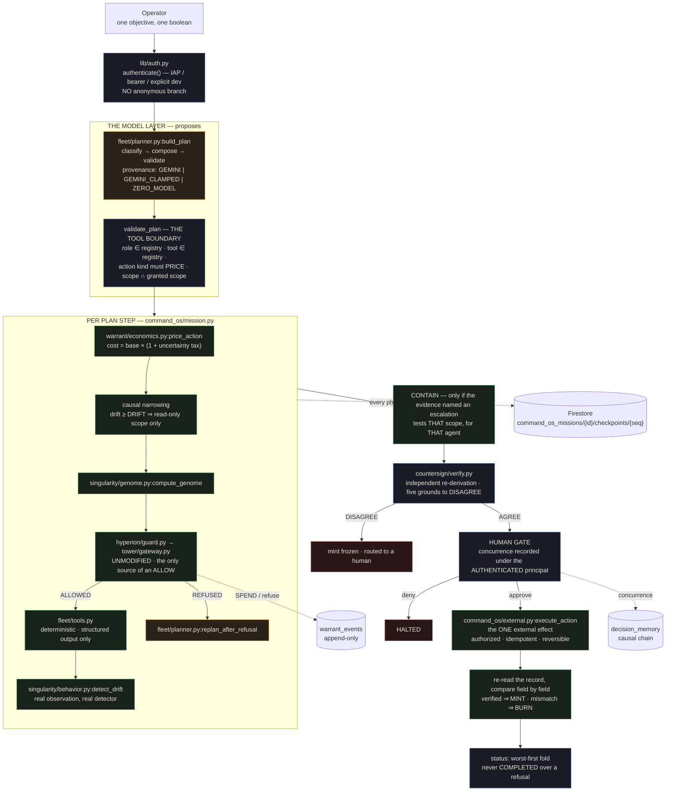

# Agentic Command OS — master architecture

This is the architecture of the layer `command_os/` and `fleet/` add on top of
UNWIND's six existing control layers. It does not replace `ARCHITECTURE.md`
(the UNWIND-core / consequence-clearing architecture, one level down).

**Read this in under 90 seconds.** A model authors a plan. Arithmetic decides
whether each step of it may run. Those are different layers, they are in
different packages, and the second one cannot import a model client — a
property `tests/test_warrant_zero_model.py` and `tests/test_tower_zero_model.py`
prove by walking the import graph.

## The chain



**Amber proposes. Green decides. Blue governs. Red stops.** No amber box can
write to the ledger, price an action, or produce an ALLOW.

## The one property everything else rests on

`tower/gateway.py` is the only module in this repository that constructs a
`GatewayDecision`, and `command_os/external.py:execute_action` is the only
function that can affect anything outside the process — and it refuses to run
without an authorization minted by the gateway path. Both are checked
mechanically:

```bash
grep -rn "GatewayDecision(" --include="*.py" . | grep -v tests/   # tower/ only
grep -rn "execute_action" --include="*.py" . | grep -v tests/     # one caller
```

## Component table

Every row names a file. A layer without one gets deleted rather than described.

### The model layer — proposes, never decides

| Component | Module | Status |
| --- | --- | --- |
| Planner (Gemini) | `fleet/agents.py:build_planner_agent` — real `LlmAgent`, real `output_schema`, real `Runner` | **CONFIGURED_NOT_EXERCISED** — no GCP credentials in this pass; see `evidence/adk/` |
| Planner (deterministic) | `fleet/planner.py:deterministic_plan` | LIVE — five objective classes, five distinct plans |
| Plan validator — **the tool boundary** | `fleet/planner.py:validate_plan` | LIVE — drops unknown roles/tools, rejects unpriceable actions, intersects scope with the registry |
| Replanner | `fleet/planner.py:replan_after_refusal` | LIVE — retry at narrowest scope, downgrade unaffordable mutations, narrow under drift. Never reclassifies risk to afford an action |
| Specialist agents | `fleet/agents.py:build_specialist_agent` × 4 | Objects LIVE; their model path shares the planner's credential status |

### The deterministic layer — decides, cannot call a model

| Component | Module | Status |
| --- | --- | --- |
| Warrant Market | `warrant/economics.py:price_action` | LIVE — `cost = base × (1 + tax)`, integer only, ceiling-rounded |
| Uncertainty tax | `warrant/economics.py:assess_uncertainty` | LIVE — six independent signals, each named in the result |
| Capability Genome | `singularity/genome.py:compute_genome` | LIVE — pure function |
| Behavioral DNA | `singularity/behavior.py:detect_drift` | LIVE — pure function, real observations |
| Hyperion-Zero | `hyperion/guard.py:evaluate_with_hyperion` | LIVE — read-only; never overturns the Gateway |
| Control Tower | `tower/gateway.py:evaluate_gateway` | LIVE — **the only source of an ALLOW in the repository** |
| Warrant ledger | `warrant/ledger.py` | LIVE — append-only, atomic spend, mint gated on two independent records |
| Specialist tools | `fleet/tools.py` | LIVE — deterministic parse/compare/verify; structured output only |
| Output contracts | `fleet/contracts.py` | LIVE — shape, self-consistency and **grounding in the worker's own inputs**, checked before a result may write into mission state |
| Authority reconciliation | `fleet/tools.py:reconcile_adjudicate` | LIVE — a second derivation from an authority ladder; the disagreement with the recency rule is the finding |
| Supervised tool runner | `command_os/mission.py:_run_tool` | LIVE — real timeout, bounded retries, three named failure kinds (TIMED_OUT / RAISED / CONTRACT) |

### The governance layer

| Component | Module | Status |
| --- | --- | --- |
| Authentication | `lib/auth.py` | LIVE — IAP / bearer / explicit dev, **no anonymous branch** |
| Route protection | `services/api/security.py` | LIVE — route-table walk fails the build on an unprotected mutation |
| Simulation policy | `lib/simulation.py` | LIVE — explicit, immutable, hard production clamp |
| Independent challenger | `countersign/verify.py:_zero_model_challenge` | LIVE (ZERO-MODEL) — five named grounds to disagree |
| Challenger (Gemma) | `countersign/agent.py` + `_run_gemma_async` | CONFIGURED_NOT_EXERCISED — real path; `evidence/adk/live-call-attempt-*.log` shows it failing closed |
| Human Override Gate | `command_os/mission.py:_phase_gate` | LIVE — records the **authenticated** principal; cannot overturn a Gateway refusal |
| Decision Memory | `tower/memory.py` | LIVE — append-only causal chain, not a vector store |
| Recall one-way valve | `recall/guard.py` | LIVE — recalled knowledge may raise a risk class or ask for a read-only check; `ScrutinyDirective` has no field capable of granting scope, and one that gains such a field is refused at construction |

### State, effect and evidence

| Component | Module | Status |
| --- | --- | --- |
| Mission checkpoints | `command_os/checkpoint.py` | LIVE — the work queue and cursor live in the checkpointed context |
| Resumability | `command_os/mission.py:resume_mission` | LIVE — no double spend, no duplicate event, no duplicate external action |
| External action | `command_os/external.py` | LIVE (SANDBOX BACKEND) — the one external effect; GitHub adapter CONFIGURED_NOT_EXERCISED |
| Messy-data synthesis | `fleet/tools.py:recon_extract_claims` over `fleet/data/incident/` | LIVE — measured coverage 16/20, and that number feeds the tax |
| Trusted State | `command_os/trust.py` | LIVE — categorical, never a score |
| Context Firewall | `command_os/context_firewall.py` | LIVE (DISPLAY FILTER) — scores context; does not gate what resume reconstructs |
| Mission knowledge | `recall/distill.py` → `recall/store.py` | LIVE — every completed mission distils what it MEASURED into atomic, provenanced, content-addressed records; append-only, no model anywhere |
| Bounded retrieval | `recall/index.py` | LIVE — metadata filter + BM25-shaped lexical score, capped at `RECALL_TOP_K` records and `RECALL_CHAR_BUDGET` characters, reporting what it dropped. **No vector store**, and the module argues the case from this corpus's properties rather than inheriting `tower/memory.py`'s argument — and names the condition for revisiting it |
| Red team | `tests/test_adversarial.py` + `tests/test_recall_guard.py` | LIVE (TEST SUITE) — 20 attacks + one declared undefended gap, plus the knowledge store attacked directly |
| Digital Twin / Veo / Lyria / multi-tenancy | — | DESIGNED — not built |

## What this system does not do

**It does not force a call into `spine/cascade.py`.** UNWIND core's job is
computing what must be un-sent, un-paid, or apologised for when a *claim*
turns out false. This layer's missions are about agent authority, and no claim
is retracted in them. Forcing an unrelated call into that path to check a box
would be exactly the decorative wiring this repository's honesty discipline
exists to refuse. UNWIND core is fully live and independently reachable as its
own card. The two layers share a thesis — a premise moved, so something built
on it is now wrong — and they share the incident fixture's contradicting
`supplier_K` lead-time records, which `recon.extract_claims` genuinely finds.

**It does not spawn agent processes.** Five roles are registered from static
definitions in `fleet/roles.py`. They have real, separate identities in the
registry with real, separately-enforced scope — but nothing forks.

**It does not call a model in the authority path, and structurally cannot.**
`warrant/` and `tower/` are covered by import-graph tests, and
`tower/gateway.py`'s warrant check is an ADK `FunctionNode`, a node type the
framework itself guarantees contains no model.

**It has not run against live Vertex in this pass.** See `evidence/INDEX.md`
§8's "Explicitly NOT evidenced" table.

## Google Cloud services actually used

Carried over from `ARCHITECTURE.md`'s own table — this layer introduces no
new Google Cloud dependency, it only sequences calls into code that already
used these services:

| Service | Used by |
| --- | --- |
| Firestore | `warrant/ledger.py`, `tower/registry.py`, `hyperion/immune_memory.py`, `singularity/mesh_memory.py`, `command_os/checkpoint.py` (new: `command_os_missions/{id}/checkpoints/{seq}`, mirroring the existing `cascades/{id}/nodes` subcollection pattern in `lib/firestore.py` — every query is a single-field `order_by` with no combined `.where()` filter, so it needs no new entry in `infra/indexes.json`, unlike `decision_memory`'s composite index, `docs/DEPLOY.md`) |
| Pub/Sub | `lib/pubsub.py` (UNWIND core's cascade fan-out; not touched by `command_os/`) |
| Cloud Run | hosts the whole FastAPI app, including `/api/command-os/*` |
| Vertex AI | `lib/vertex.py`, reachable from `countersign/agent.py`'s real Gemma path — not called during a `command_os` mission run, which always sets `UNWIND_COUNTERSIGN_SIMULATED=1` |

Deliberately **NOT USED** (same list `ARCHITECTURE.md` already states,
unchanged by this layer): GKE, Cloud SQL/Spanner, BigQuery, Dataflow,
Redis/Memorystore, Model Armor, Dataplex.

## The 15-name concept map

FleetGuard, AutoAudit, Self-Repairing Fleet, Cross-Department Orchestrator,
Overlord AI, Phoenix, ShadowAudit, OmniFleet, Chronos-9, Aegis-Neuro,
Chronos-Void, Pandora, Vigilante AI, Nexus Command, and Nebula OS do not
appear anywhere in this repository's code, docs, or evidence — a
repository-wide search finds zero hits. Each name is mapped to the real
module that provides its functional purpose, with an honest status, in
`docs/COMMAND-OS-CONCEPT-MAP.md` (single source of truth:
`command_os/concept_map.py`). This document does not repeat that table.
